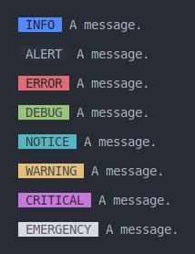

# PHP CliPrinter library

[](https://packagist.org/packages/josantonius/cli-printer)
[](LICENSE)
[](https://packagist.org/packages/josantonius/cli-printer)
[](https://github.com/josantonius/php-cli-printer/actions/workflows/ci.yml)
[](https://codecov.io/gh/josantonius/php-cli-printer)
[](https://www.php-fig.org/psr/psr-1/)
[](https://www.php-fig.org/psr/psr-4/)
[](https://www.php-fig.org/psr/psr-12/)

PHP library for print messages in the command line interface (CLI).
Optionally supports [Monolog\Logger](https://github.com/Seldaek/monolog).

For development or test environments you can disable on-console message
output by defining a constant named `DISABLE_CONSOLE_PRINTING`.

---

- [Requirements](#requirements)
- [Installation](#installation)
- [Available Classes](#available-classes)
  - [CliPrinter Class](#cliprinter-class)
  - [Color Class](#color-class)
- [Usage](#usage)
- [Tests](#tests)
- [TODO](#todo)
- [Changelog](#changelog)
- [Contribution](#contribution)
- [Sponsor](#sponsor)
- [License](#license)

---

## Requirements

- Operating System: Linux.

- PHP versions: 8.1 | 8.2.

## Installation

The preferred way to install this extension is through [Composer](http://getcomposer.org/download/).

To install **PHP CliPrinter library**, simply:

```console
composer require josantonius/cli-printer
```

The previous command will only install the necessary files,
if you prefer to **download the entire source code** you can use:

```console
composer require josantonius/cli-printer --prefer-source
```

You can also **clone the complete repository** with Git:

```console
git clone https://github.com/josantonius/php-cli-printer.git
```

## Available Classes

### CliPrinter Class

`Josantonius\CliPrinter\CliPrinter`

Create new instance:

```php
/**
 * @param array $messages The messages to be printed, in the format ['id' => 'message'].
 */
public function __construct(protected array $messages = []);
```

Display a message on the console:

```php
/**
 * Formatter: The $message and $params work in a similar way as the sprintf method:
 *            display('tag', 'The %s %d', ['message', 8]).
 *
 * Messages:  If $messages was provided, the message can be replaced by the ID:
 *            display('tag', 'user.error').
 *
 * Logger:    If used and the tag name of the message matches a level,
 *            it shall be used when adding the record. Otherwise use the debug level.
 *
 * @param string $tagName Message tag name.
 * @param string $message The message or message ID.
 * @param array  $params  Additional context for format $message or/and passing it to the log.
 */
public function display(string $tagName, string $message, array $params = []): self;
```

Dynamically display a message using the message tag as the method name:

```php
/**
 * @param string $tagName   Message tag name.
 * @param string $arguments The first value is the message and the second the parameters.
 */
public function __call(string $tagName, array $arguments): self;
```

Add an instance of Monolog\Logger to add a log for each message displayed:

```php
/**
 * @param Logger $logger Instance of the Logger class.
 */
public function useLogger(Logger $logger): self;
```

Print new lines on the console:

```php
/**
 * @param int $times Number of new lines to print.
 */
public function newLine(int $times = 1): self;
```

Set the number of line breaks before and after a message:

```php
/**
 * @param int $before Number of line breaks before a message.
 * @param int $after  Number of line breaks after a message.
 */
public function setLineBreaks(int $before, int $after): self;
```

Set the default color of the message tags:

```php
/**
 * @param Color $color Default message tag color.
 */
public function setDefaultTagColor(Color $color): self;
```

Set the color for a message tag:

```php
/**
 * @param string $tagName  Message tag name.
 * @param Color  $tagColor Message tag color.
 */
public function setTagColor(string $tagName, Color $tagColor): self;
```

### Color Class

`Josantonius\CliPrinter\Color`

Available colors:

```php
enum Color: int
{
    case BLACK  = 40;
    case RED    = 41;
    case GREEN  = 42;
    case YELLOW = 43;
    case BLUE   = 44;
    case PURPLE = 45;
    case CYAN   = 46;
    case WHITE  = 47;
}
```

## Usage

Example of use for this library:

### Displaying messages

```php
use Josantonius\CliPrinter\CliPrinter;

$printer = new CliPrinter();

$printer->display('alert', 'An alert message.');
$printer->display('error', 'An error message.');
```


### Displaying messages without a tag

```php
use Josantonius\CliPrinter\CliPrinter;

$printer = new CliPrinter();

$printer->display('', 'A message without a tag.');
```


### Displaying preset messages via their key

```php
use Josantonius\CliPrinter\CliPrinter;

$printer = new CliPrinter([
    'user.created' => 'User created.',
    'user.changed' => 'User changed.',
]);

$printer->display('create', 'user.created');
$printer->display('change', 'user.changed');
```


### Displaying formatted messages

```php
use Josantonius\CliPrinter\CliPrinter;

$printer = new CliPrinter([
    'msg.notice' => 'A %s message.',
]);

$printer->display('notice', 'msg.notice', ['notice']);

$printer->display('detail', 'A %s message.', ['detail']);
```


### Changing the line breaks before and after each message

```php
use Josantonius\CliPrinter\CliPrinter;

$printer = new CliPrinter();

$printer->setLineBreaks(before: 1, after: 0);

$printer->display('alert', 'Alert message.');
$printer->display('error', 'Error message.');
```


```php
use Josantonius\CliPrinter\CliPrinter;

$printer = new CliPrinter();

$printer->setLineBreaks(before: 2, after: 1);

$printer->display('alert', 'Alert message.');
$printer->display('error', 'Error message.');
```


### Adding extra line breaks

```php
use Josantonius\CliPrinter\CliPrinter;

$printer = new CliPrinter();

$printer->display('request', 'Message.');

$printer->newLine();
$printer->display('response', 'Message.');
$printer->newLine(times: 3);

$printer->display('warning', 'Message.');
```


### Changing default color of tags

```php
use Josantonius\CliPrinter\Color;
use Josantonius\CliPrinter\CliPrinter;

$printer = new CliPrinter();

$printer->setDefaultTagColor(Color::PURPLE);

$printer->display('alert', 'An alert message.');
$printer->display('error', 'An error message.');
```


### Set a custom color for each tag

```php
use Josantonius\CliPrinter\Color;
use Josantonius\CliPrinter\CliPrinter;

$printer = new CliPrinter();

$printer->setTagColor('info',      Color::BLUE)
        ->setTagColor('alert',     Color::BLACK)
        ->setTagColor('error',     Color::RED)
        ->setTagColor('debug',     Color::GREEN)
        ->setTagColor('notice',    Color::CYAN)
        ->setTagColor('warning',   Color::YELLOW)
        ->setTagColor('critical',  Color::PURPLE)
        ->setTagColor('emergency', Color::WHITE);

$printer->display('info',      'A message.');
$printer->display('alert',     'A message.');
$printer->display('error',     'A message.');
$printer->display('debug',     'A message.');
$printer->display('notice',    'A message.');
$printer->display('warning',   'A message.');
$printer->display('critical',  'A message.');
$printer->display('emergency', 'A message.');
```



### Displaying messages using dynamic methods

```php
use Josantonius\CliPrinter\CliPrinter;

$printer = new CliPrinter();

$printer->request('A request message.');

$printer->response('A %s message.', ['response']);
```


### Using [Monolog\Logger](https://github.com/Seldaek/monolog)

```php
use Monolog\Logger;
use Monolog\Handler\StreamHandler;
use Josantonius\CliPrinter\CliPrinter;

$logger  = new Logger('LOG');
$logger->pushHandler(new StreamHandler(__DIR__ . '/log.txt'));

$printer = new CliPrinter();
$printer->useLogger($logger);

/**
 * It will create a "notice" log.
 * 
 * [2023-01-13T19:50:47.954791+00:00] LOG.NOTICE: A notice message. {"foo":"bar"} []
 */
$printer->display('notice', 'A notice message.', ['foo' => 'bar']);

/**
 * It will create a "debug" log as there is no "create" level.
 * 
 * [2023-01-13T19:50:47.954319+00:00] LOG.DEBUG: A create message. ["create"] []
 */
$printer->display('create', 'A %s message.', ['create']);
```


## Tests

To run [tests](tests) you just need [composer](http://getcomposer.org/download/)
and to execute the following:

```console
git clone https://github.com/josantonius/php-cli-printer.git
```

```console
cd php-cli-printer
```

```console
composer install
```

Run unit tests with [PHPUnit](https://phpunit.de/):

```console
composer phpunit
```

Run code standard tests with [PHPCS](https://github.com/squizlabs/PHP_CodeSniffer):

```console
composer phpcs
```

Run [PHP Mess Detector](https://phpmd.org/) tests to detect inconsistencies in code style:

```console
composer phpmd
```

Run all previous tests:

```console
composer tests
```

## TODO

- [ ] Add new feature
- [ ] Improve tests
- [ ] Improve documentation
- [ ] Improve English translation in the README file
- [ ] Refactor code for disabled code style rules (see phpmd.xml and phpcs.xml)

## Changelog

Detailed changes for each release are documented in the
[release notes](https://github.com/josantonius/php-cli-printer/releases).

## Contribution

Please make sure to read the [Contributing Guide](.github/CONTRIBUTING.md), before making a pull
request, start a discussion or report a issue.

Thanks to all [contributors](https://github.com/josantonius/php-cli-printer/graphs/contributors)! :heart:

## Sponsor

If this project helps you to reduce your development time,
[you can sponsor me](https://github.com/josantonius#sponsor) to support my open source work :blush:

## License

This repository is licensed under the [MIT License](LICENSE).

Copyright © 2023-present, [Josantonius](https://github.com/josantonius#contact)
